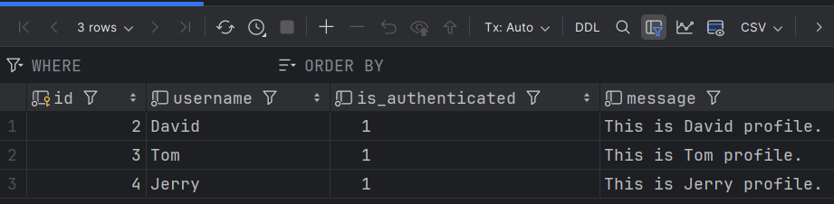
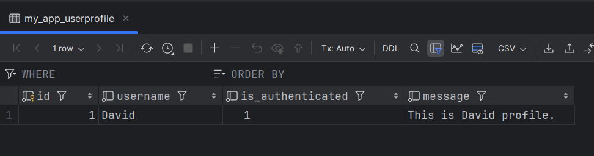

# Day 12 - 資料庫操作

- 使用shell command
- 創建和保存資料
- 新增 修改 刪除


## 一、使用shell command

Django 提供了一個交互式 shell，可以讓我們直接操作資料庫，這樣我們可以快速地測試和調試我們的 app。

```commandline
python manage.py shell
```

## 二、創建(新增)和保存資料
在 shell 中，我們可以直接操作資料庫，要在資料庫中創建和保存一個新的實例，可以使用模型的 `create` 方法或先創建實例然後調用 `save` 兩種方法。

使用 create 方法：
```python
from my_app.models import UserProfile
new_post = UserProfile.objects.create(username='David', is_authenticated=True, message='This is David profile.')
```

使用 save 方法：
```python
from my_app.models import UserProfile
user = UserProfile(username='David', is_authenticated=True, message='This is David profile.')
user.save()
```  

當出現以下的資料那就代表成功建立資料表以及一筆資料


除了單獨創建之外還有批量創建的方法

bulk create 批次創建，一次創建三筆資料
```python
UserProfile.objects.bulk_create([
    UserProfile(username='David', is_authenticated=True, message='This is David profile.'),
    UserProfile(username='Tom', is_authenticated=True, message='This is Tom profile.'),
    UserProfile(username='Jerry', is_authenticated=True, message='This is Jerry profile.')
])
```


## 三、修改和刪除

我們可以使用以下方法來修改、刪除資料表中的資料。

### 1. 修改資料

```python
# 修改資料
user = UserProfile.objects.get(username='David')
user.message = 'This is updated message.'
user.save()
```
- 這裡我們先找到 `username` 為 `David` 的資料，然後修改 `message` 的內容，最後保存。


### 2. 刪除資料

```python
# 刪除資料
user = UserProfile.objects.get(username='David')
user.delete()
```
- 這裡我們先找到 `username` 為 `David` 的資料，然後刪除。


## 四、總結
今天我們學習了如何使用 shell command 來操作資料庫，以及如何創建、保存、修改和刪除資料表中的資料。下一篇文章我們將會學習如何進行資料的查詢。

## 五、參考資料
- https://ithelp.ithome.com.tw/articles/10301357