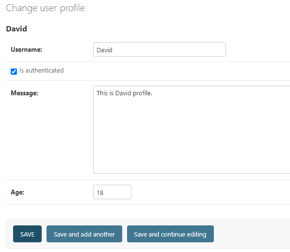

# Day 17 - 管理站台 (Admin Site)

- 設置和使用Django管理後台
   - 創建superuser
   - 註冊模型到管理站台
   - 使用管理站台


## 一、設置和使用Django管理後台

Django 提供了一個內置的管理站台（Admin Site），用於管理網站的後台管理功能。管理站台提供了一個用戶友好的界面，可以讓開發者和管理員輕鬆地管理網站的資料。

### 1. 創建 superuser

在使用管理站台之前，我們需要創建一個超級用戶（Superuser），有這個身分才能登錄管理站台。要創建超級用戶，可以運行以下命令：

```commandline
python manage.py createsuperuser
```


然後按照上面提示輸入用戶名、電子郵件和密碼，即可創建一個超級用戶。

創建成功後，可以在瀏覽器中訪問 `/admin` 路徑，然後使用剛剛創建的超級用戶登錄管理站台，一開始進來的時候是只有內建的 Groups 和 Users 管理介面。


### 2. 註冊模型到管理站台

要在管理站台中管理  模型，我們需要將模型註冊到管理站台。要註冊模型，可以在 `my_app/admin.py` 文件中定義 `ModelAdmin` 類，然後將其註冊到管理站台。

```python
# my_app/admin.py
from django.contrib import admin
from .models import UserProfile, Order


class UserProfileAdmin(admin.ModelAdmin):
    fields = ('username', 'is_authenticated', 'message', 'age')
    list_display = ('username', 'is_authenticated', 'message', 'age')
    search_fields = ('username',)


class OrderAdmin(admin.ModelAdmin):
    fields = ('order_number', 'user_profile')
    list_display = ('order_number', 'order_date', 'user_profile')
    search_fields = ('order_number',)


admin.site.register(UserProfile, UserProfileAdmin)
admin.site.register(Order, OrderAdmin)
```
- 在這個示例中，我們定義了兩個 `ModelAdmin` 類 `UserProfileAdmin` 和 `OrderAdmin`，並設置了 `fields`、`list_display` 和 `search_fields` 等屬性。 
  - `fields` 屬性用於設置在管理站台中顯示的字段
  - `list_display` 屬性用於設置在列表頁中顯示的字段
  - `search_fields` 屬性用於設置可以通過搜索框搜索的字段
- 然後通過 `admin.site.register` 方法將 `UserProfile` 和 `Order` 模型註冊到管理站台。


### 3. 使用管理站台

啟動開發服務器後，可以在瀏覽器中訪問 `/admin` 路徑，然後使用剛剛創建的超級用戶登錄管理站台。


在管理站台中，可以看到所有已註冊的模型，並可以對模型的數據進行增刪改查等操作，其中可以有原本內建預設的 Group 和 Users，以及我們去建立的 Orders 和 User profiles。




> 如果希望介面是中文的話，可以在 `settings.py` 中設置 `LANGUAGE_CODE = 'zh-hans'`，這樣管理站台的介面就會是中文的了。

#### 做一些站台的調整

因為我們已知 `Order` 和 `UserProfile` 有關聯，所以我們可以在 `UserProfile` 的管理介面中直接顯示 `Order` 的相關信息。

```python
# my_app/admin.py
from django.contrib import admin
from .models import UserProfile, Order


class OrderInline(admin.TabularInline):
    fields = ('order_number',)
    list_display = ('order_number', 'order_date')
    model = Order
    extra = 0


class UserProfileAdmin(admin.ModelAdmin):
    fields = ('username', 'is_authenticated', 'message', 'age')
    list_display = ('username', 'is_authenticated', 'message', 'age')
    search_fields = ('username',)
    inlines = [OrderInline]
```
- 定義了一個 `OrderInline` 類，並設置了 `fields`、`list_display` 和 `model` 等屬性，然後將其添加到 `UserProfileAdmin` 的 `inlines` 屬性中。
這個 `OrderInline` 類是一個內聯類，用於在 `UserProfile` 的管理介面中顯示 `Order` 的相關信息。


- 這樣我們就能直接在 UserProfile 的管理介面中看到與其關聯的 Order 有哪些了。

## 二、總結

這篇文章介紹了如何設置和使用 Django 管理站台，包括創建超級用戶、註冊模型到管理站台、使用管理站台等操作。
管理站台提供了一個用戶友好的界面，可以讓開發者和管理員輕鬆地管理網站的資料。
下一篇文章我們將會學習建立表單（Forms）。

## 三、參考資料
- https://ithelp.ithome.com.tw/articles/10236015
- 
