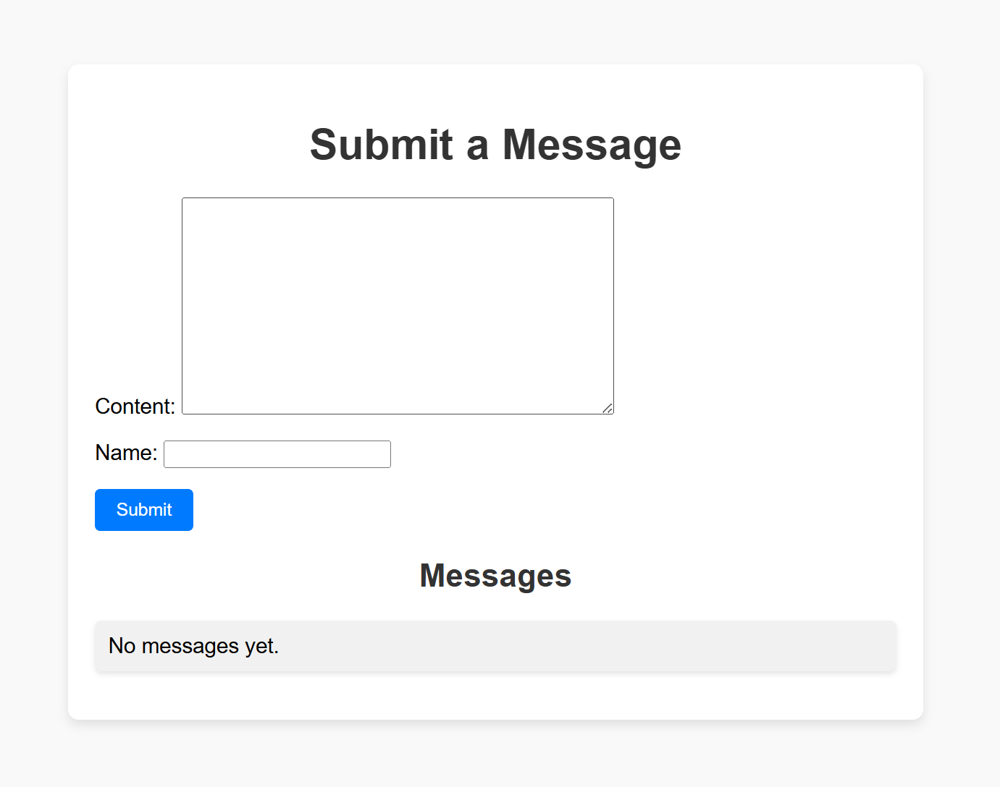
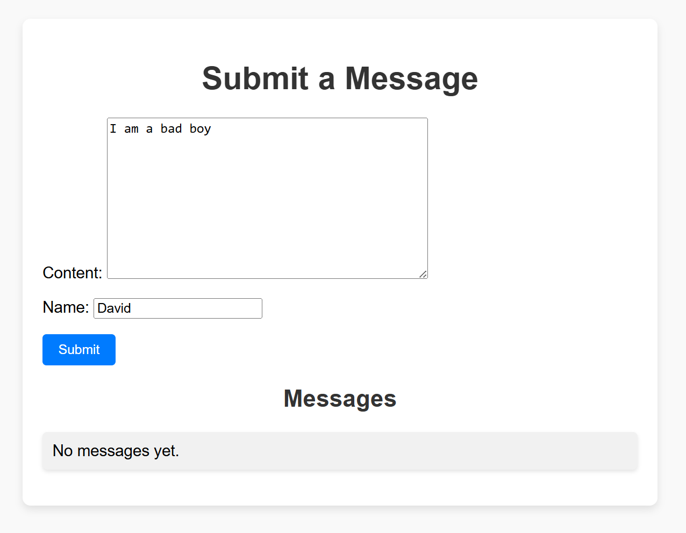
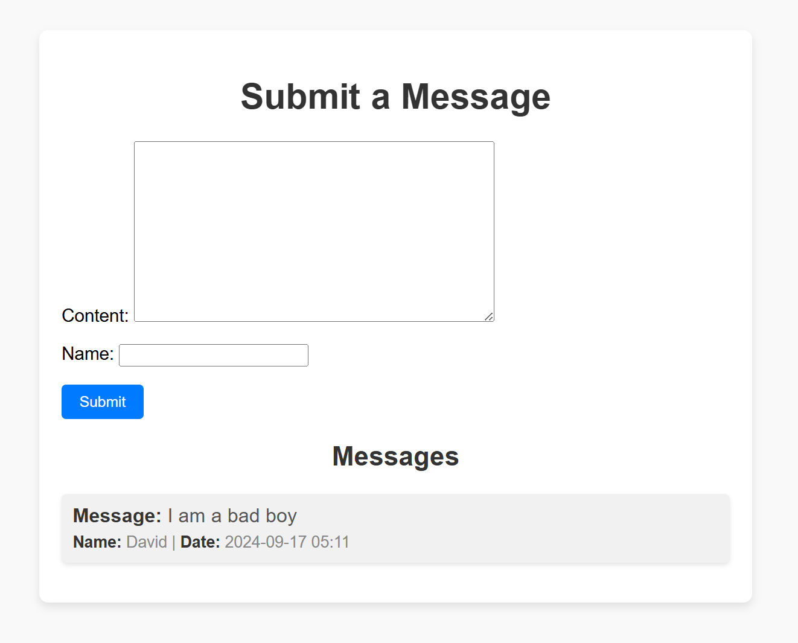

# Day 19 - Views 進階 - Class Based Views (CBVs)

- 為何要使用 CBVs
- 常用的Class-Based Views
- 創建一個 CBV

在之前的文章中，我們介紹了如何使用函數來創建 Views，這種方式稱為 Function-Based Views（FBVs）。在這篇文章中，我們將介紹另一種創建 Views 的方式，即 Class-Based Views

## 一、為何要使用 CBVs

簡單來說就是 Class-Based Views（CBVs）是更容易維護的 Views 建立方式也比較容易去做維護，在開發時使用 CBVs 會相較於 FBVs 來的更實用。

以下是一些使用 CBVs 的好處：

- 代碼重用：可以通過繼承基礎類視圖來創建其他 Views，這樣可以減少重複的 code。
- 更容易擴展：我們可以通過繼承和重寫方法來擴展。
- 更多的功能和選項：通用視圖（Generic Views）是一些預定義的類視圖，專門用來處理常見的任務，如顯示列表、處理表單提交、顯示單個物件的詳細信息等。

## 二、常用的 Class-Based Views

Django 提供了許多內置的 Class-Based Views，這些 Views 可以幫助我們快速地實現常見的功能。以下是一些常用的 Class-Based Views：

- `View`：是最基礎的 CBV，它不具備任何預設的行為。需要覆寫它的 get 或 post 方法來處理請求。
- `TemplateView`：用來渲染模板，最適合用來處理不需要複雜邏輯的靜態頁面或基於上下文變量顯示內容的頁面。
- `ListView`：用於從數據庫中查詢多個對象並以列表形式顯示。它會自動將指定模型中的數據查詢出來並傳遞給模板
- `DetailView`：用於顯示單個對象的詳細信息。它根據傳入的主鍵（通常是 URL 中的參數）來查詢數據庫中的對象，並將對象傳遞給模板進行渲染。
- `CreateView`：提供了一個表單來讓用戶創建新的對象，並在表單提交後自動保存到數據庫，CreateView 會根據模型自動生成表單，並處理表單驗證和數據保存。
- `UpdateView`：它與 CreateView 類似，但它是用來更新現有的對象。UpdateView 自動生成表單，並填充已有對象的數據，讓用戶可以編輯並保存更新後的數據。
- `DeleteView`：用來刪除現有的對象。當用戶請求刪除某個對象時，DeleteView 顯示確認頁面，並在用戶確認後刪除該對象。刪除成功後，它會重定向到指定的成功URL。
- `FormView`：提供了顯示和處理表單的邏輯。與 CreateView 和 UpdateView 不同，它不直接與某個模型對象綁定，而是更通用的表單處理視圖。所以需要自行定義表單提交後的處理邏輯（如發送郵件、保存數據等）。

> 如果有興趣去深入研究這些方法我這裡附上[官方的連結](https://docs.djangoproject.com/en/5.1/ref/class-based-views/)，可以點進去看更多的不同的 Generic Views。

## 三、創建一個 CBV

以下是一個簡單的示例，展示如何創建一個基於 Class-Based Views
    
    ```python
    from django.views.generic import View
    from django.http import HttpResponse

    class HelloWorldView(View):
        def get(self, request):
            return HttpResponse('Hello, World!')
    ```

在這個示例中，我們定義了一個名為 `HelloWorldView` 的 Class-Based View，它繼承自 `View` 類。我們重寫了 `get` 方法，當收到 GET 請求時，該方法將返回一個包含 `Hello, World!` 的響應。

要在項目中使用這個 CBV，我們需要將它添加到 URL 配置中：

    ```python
    from django.urls import path
    from .views import HelloWorldView

    urlpatterns = [
        path('hello/', HelloWorldView.as_view(), name='hello'),
    ]
    ```

在這個示例中，我們將 `HelloWorldView` 添加到 URL 配置中，並將其命名為 `hello`。當用戶訪問 `/hello/` 時，將調用 `HelloWorldView` 的 `get` 方法，並返回 `Hello, World!` 的響應。

這樣，我們就成功創建了一個基於 Class-Based Views 的 Views。


------

我現在使用 `View` 類來實現完整的 `GET` 和 `POST` 方法，包括模型、URL 和模板設置的完整範例。
(自由去建立 app 或是使用原來的 app 做撰寫)

### 1. 模型 (Model)
首先，我們定義一個簡單的模型來表示數據對象。在這個例子中，我們創建一個簡單的 `Message` 模型，用來保存來自表單提交的訊息(_記得要做migrate_)。

```python
from django.db import models

class Message(models.Model):
    content = models.TextField()
    name = models.CharField(max_length=20)
    created_at = models.DateTimeField(auto_now_add=True)

    def __str__(self):
        return self.content[:20]
```

### 2. 表單 (Form)
為了處理 `POST` 請求，我們會設置一個簡單的 Django 表單，用於提交訊息。

```python
from django import forms
from .models import Message

class MessageForm(forms.ModelForm):
    class Meta:
        model = Message
        fields = ['content', 'name']
```

### 3. 視圖 (View)
現在我們來實現 `View` 類的 `GET` 和 `POST` 方法。`GET` 方法會顯示一個表單，以及之前提交過的訊息列表，而 `POST` 方法會處理表單提交並保存訊息。

```python
from django.http import HttpResponse, HttpResponseRedirect
from django.urls import reverse
from django.views import View
from django.shortcuts import render
from .models import Message
from .forms import MessageForm

class MessageView(View):
    def get(self, request):
        # 顯示表單以及已提交的訊息列表
        form = MessageForm()
        messages = Message.objects.all()
        return render(request, 'message.html', {'form': form, 'messages': messages})

    def post(self, request):
        # 處理表單提交
        form = MessageForm(request.POST)
        if form.is_valid():
            form.save()
            return HttpResponseRedirect(reverse('message_view'))  # 成功後重定向
        messages = Message.objects.all()  # 如果表單無效，仍顯示訊息列表
        return render(request, 'message.html', {'form': form, 'messages': messages})

```

### 4. 模板 (Template)
`message.html` 模板用來顯示表單和訊息列表，這裡我給兩個版本一個是簡單版的一個是有加上 css 的美化。

```html
<!DOCTYPE html>
<html>
<head>
    <title>Message Board</title>
</head>
<body>
    <h1>Submit a Message</h1>

    <form method="post">
        
        {{ form.as_p }}
        <button type="submit">Submit</button>
    </form>

    <h2>Messages</h2>
    <ul>
        
            <li>{{ message.content }} ({{ message.created_at }})</li>
        
            <li>No messages yet.</li>
        
    </ul>
</body>
</html>
```

```html
<!-- myapp/templates/message.html -->
<!DOCTYPE html>
<html>
<head>
    <title>Message Board</title>
    <style>
        body {
            font-family: Arial, sans-serif;
            background-color: #f9f9f9;
            margin: 0;
            padding: 0;
            display: flex;
            justify-content: center;
            align-items: center;
            height: 100vh;
        }

        .container {
            background-color: #fff;
            padding: 20px;
            box-shadow: 0 4px 8px rgba(0, 0, 0, 0.1);
            border-radius: 8px;
            width: 100%;
            max-width: 600px;
        }

        h1, h2 {
            color: #333;
            text-align: center;
        }

        form {
            margin-bottom: 20px;
        }

        button {
            padding: 8px 16px;
            background-color: #007bff;
            color: #fff;
            border: none;
            border-radius: 4px;
            cursor: pointer;
        }

        button:hover {
            background-color: #0056b3;
        }

        ul {
            list-style-type: none;
            padding: 0;
        }

        li {
            background-color: #f1f1f1;
            padding: 10px;
            margin-bottom: 10px;
            border-radius: 5px;
            box-shadow: 0 2px 4px rgba(0, 0, 0, 0.1);
        }

        .message-content {
            font-size: 1.1em;
            margin-bottom: 5px;
            color: #555;
        }

        .message-meta {
            font-size: 0.9em;
            color: #888;
        }

        strong {
            color: #333;
        }
    </style>
</head>
<body>
    <div class="container">
        <h1>Submit a Message</h1>

        <form method="post">
            
            {{ form.as_p }}
            <button type="submit">Submit</button>
        </form>

        <h2>Messages</h2>
        <ul>
            
                <li>
                    <div class="message-content">
                        <strong>Message:</strong> {{ message.content }}
                    </div>
                    <div class="message-meta">
                        <strong>Name:</strong> {{ message.name }} | <strong>Date:</strong> {{ message.created_at|date:"Y-m-d H:i" }}
                    </div>
                </li>
            
                <li>No messages yet.</li>
            
        </ul>
    </div>
</body>
</html>
```

### 5. URL 配置 (URL Configuration)
在 `urls.py` 中設置這個視圖的 URL 路由。

```python
from django.urls import path
from .views import MessageView

urlpatterns = [
    path('messages/', MessageView.as_view(), name='message_view'),
]
```
- 使用 `.as_view()` 方法將其轉換為可路由的視圖函數

**看看效果如何**


這是沒有任何訊息時的樣子，下方`get()`方法會顯示一個提交訊息的表單，但現在沒有任何訊息




這裡我們打上訊息以及我們的名字，按下`Submit`的當下`post()`方法會處理表單數據，並將新訊息保存到數據庫中。成功後，使用 HttpResponseRedirect 進行重定向，以避免重複提交表單。

## 四、總結

在這篇文章中，我們介紹了 Class-Based Views（CBVs）的好處、常用的 Class-Based Views，也實作了一個完整例子。
它是更加強大和靈活的 Views 實現方式，它提供了更多的功能和選項，並且更容易維護和擴展。
通過學習和使用 CBVs，我們可以更好地 coding 提高開發效率。下一篇我們要介紹 Session framework。

## 五、參考資料
- https://docs.djangoproject.com/en/5.1/topics/class-based-views/
