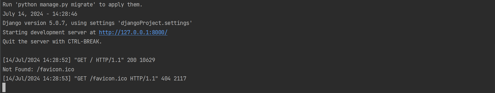

# Day 4 - 開始創建 Django 專案 (Day2的廉潔要更換)
- 創建django專案
- 項目結構說明
- 設定資料庫


## 一、創建 Django 專案

在這個章節我們會開始創建 Django 專案，首先我們要確保你已經安裝好 Django，如果還沒有安裝可以參考[Day2](https://ithelp.ithome.com.tw/articles/10257357)的教學。

1. 開啟終端機，輸入以下指令創建 Django 專案
    ```commandline
    django-admin startproject mysite
    ```
    - `mysite` 是專案的名稱，可以自行更改
    - 執行完後會看到以下結構，下面會加以介紹
    ```
    mysite/
    ├── manage.py
    └── mysite/
        ├── __init__.py
        ├── asgi.py
        ├── settings.py
        ├── urls.py
        └── wsgi.py
    ```
2. 我們可以進入到專案資料夾，在 terminal 輸入指令啟動 Django  
    ```commandline
    cd mysite
    python manage.py runserver
    ```
- 終端機會顯示以下畫面
  

- 接著點開*http://127.0.0.1:8000*看到以下畫面代表成功建立


## 二、項目結構說明
- `manage.py` 是一個命令列工具，可以讓你用各種方式和你的 Django 專案互動
- `mysite/` 是專案的 Python package，包含了你的專案的設定和所有的 Django 應用
- `mysite/__init__.py` 是一個空文件，告訴 Python 這個目錄應該被視為一個 Python package
- `mysite/settings.py` 是專案的設定檔
- `mysite/urls.py` 是專案的 URL 宣告
- `mysite/asgi.py` 和 `mysite/wsgi.py` 是幫助你將你的 Django 專案部署到 WSGI 兼容的 Web 伺服器的檔案
- 這些檔案是 Django 專案的基礎結構，你可以根據你的需求來修改或新增檔案
- 這樣就完成了 Django 專案的創建
- 接著我們可以進入到專案資料夾，啟動伺服器


  - 這樣就完成了 Django 專案的創建
  - 如果有任何問題歡迎在下方留言或是寄信給我

## 二、參考資料
- https://ithelp.ithome.com.tw/articles/10269181