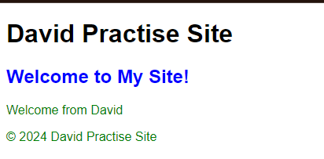

# Day 8 - 模板（Templates）
- 什麼是 Template
- 建立template
- 連接views
- 基礎語法


## 一、什麼是 Template

模板是 Django 用來生成 HTML 的文件。
它們允許我們將數據插入到靜態 HTML 中，並使網站頁面動態化。
模板系統使用標籤和過濾器來控制展示和處理數據。

## 一、建立模板
1. 在 app 的目錄下建立一個 `templates` 目錄
2. 在 `templates` 目錄下建立一個 app 目錄
3. 在 app 目錄下建立一個 `index.html` 文件
    ```commandline
    myapp/
    ├── __init__.py
    ├── admin.py
    ├── apps.py
    ├── models.py
    ├── tests.py
    ├── urls.py
    ├── views.py
    └── templates/
        └── my_app/
            └── index.html
    ```
3. 在 `index.html` 文件中輸入以下內容 (快捷鍵: 輸入doc + `tab鍵`)：
    ```html
   <!DOCTYPE html>
   <html lang="en">
   <head>
       <meta charset="UTF-8">
       <meta http-equiv="X-UA-Compatible" content="IE=edge">
       <meta name="viewport" content="width=device-width, initial-scale=1.0">
       <title>Document</title>
   </head>
   <body>
       <h1>Welcome Django</h1>
   </body>
   
   </html>
   ```

## 二、連接views
1. 在 app 的 `views.py` 中引入 `render` 函數
    ```python
    from django.shortcuts import render
    ```
2. 在視圖函數中使用 `render` 函數返回模板
    ```python
    def index_view(request):
        # 匹配到我們建立的 html 檔
        return render(request, 'my_app/index.html')
    ```
3. 在 app 的 `urls.py` 中設定路由
    ```python
    from django.urls import path
    from myapp import views

    urlpatterns = [
        path('index/', views.index_view, name='index_view'),
    ]
    ```
4. 執行查看結果
    ```commandline
    python manage.py runserver
    ```
    - 這樣就成功連結我們建立的 template
    

### 建立的步驟
1. 在 app 中的 `views.py` 中建立函數視圖
2. 在 app 中的 `urls.py` 中設定路由
3. 在 app 的 `templates` 目錄下建立模板
4. 在模板中使用基礎語法 (在模板中使用模板繼承)
6. 啟動服務查看結果

 

### 建立範例
為了方便顯示下方語法執行的結果我先建立一些範例 (這章節先不詳細介紹 model 的建立方法)

1. 在 `app/models.py` 建立一個模型 :
    ```python
    from django.db import models
    
    class UserProfile(models.Model):
        username = models.CharField(max_length=10)
        is_authenticated = models.BooleanField(default=False)
        message = models.TextField(max_length=100)
    
        def __str__(self):
            return self.username
    ```

2. 執行遷移 :
    ```commandline
    python manage.py makemigrations
    python manage.py migrate
    ```
    
3. 在 Django 管理界面或 shell 中創建一個用戶示例 :
    ```shell
    python manage.py shell
    
    from my_app.models import UserProfile
    UserProfile.objects.create(username='David', is_authenticated=True, message='This is David profile.')
    ```
4. 在 `myapp/views.py` 中創建一個新視圖來顯示模板：
    ```python
    from django.shortcuts import render
    from .models import UserProfile
    
    def index_user(request):
        user = UserProfile.objects.first()  # 自己建立的用戶
        return render(request, 'my_app/user.html', {'user': user})
    ```

5. 在 `myapp/urls.py` 中配置 URL 模式：
    ```python
   from django.urls import path
   from my_app import views
   
   urlpatterns = [
       path('user/', views.index_user, name='user')
   ]
    ```

## 三、基礎語法
模板語言包括標籤和過濾器，用來插入動態數據和控制HTML輸出。 

- **註解**: 用 {# #} 包圍
  ```html
  {# 這是個註解 #}
  ```
- **變數**: 用 {{ }} 包圍
    ```html
    <p>{{ name }}</p>
    ```
- **標籤**: 用  包圍，用來執行邏輯操作，如條件判斷和迴圈
  ```html
  
     <p>歡迎, {{ user.username }}!</p>
  
    <p>你尚未登入.</p>
  ```
- **過濾器**: 過濾器用 | 符號連接，用來修改變量的值(ex: 將文字全部變成大寫)
  ```html
  <p>{{ message|upper }}</p>
  ```     

<br>

> 接下來實際看看效果如何  

在 `myapp/templates/` 目錄下創建 user.html 文件
```html
<!DOCTYPE html>
<html lang="en">
<head>
    <head>
    <meta charset="UTF-8">
    <meta name="viewport"
          content="width=device-width, user-scalable=no, initial-scale=1.0, maximum-scale=1.0, minimum-scale=1.0">
    <meta http-equiv="X-UA-Compatible" content="ie=edge">
    <title>基礎語法範例</title>
</head>
</head>
<body>
    {# 變數插入 #}
    <p>用戶名: {{ user.username }}</p>
    
    {# 條件標籤 #}
    
        <p>歡迎, {{ user.username }}!</p>
    
        <p>你尚未登入.</p>
    

    {# 過濾器 #}
    <p>{{ user.message | upper }}</p>
</body>
</html>

```

執行結果  

- 註解的內容不會顯示出來
- 標籤的地方因為 David 的 `is_authenticated` 欄位是 True，所以會顯示歡迎
- message 的部分全部變成大寫

## 五、總結

在這篇文章中，我們學習了如何建立模板、連接視圖和模板、以及模板語言的基礎語法。模板是 Django 用來生成 HTML 的文件，它允許我們將數據插入到靜態 HTML 中，並使網站頁面動態化。模板系統使用標籤和過濾器來控制展示和處理數據。在下一篇文章中，我們將學習進階的模板使用。

